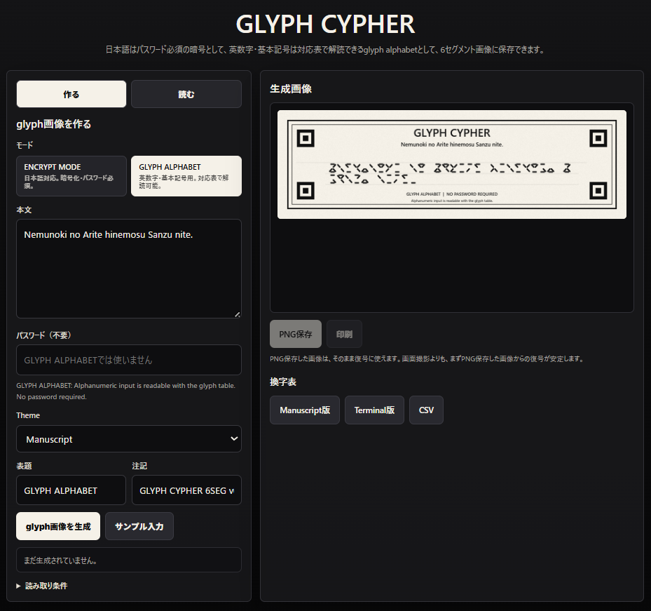

# GLYPH CYPHER 6SEG v0.1.2

6セグメント風のglyph画像を作る静的PWAです。  
現在のユーザー向けモードは **ENCRYPT MODE** と **GLYPH ALPHABET MODE** の2つです。



## Modes

### ENCRYPT MODE

日本語を含むUnicode本文をAES-GCMで暗号化します。  
PNG読み取りと復号には、作成時と同じパスワードが必要です。

- 日本語入力対応
- パスワード必須
- 保存PNGから復号可能
- パスワードがない場合、画像はただのglyph画像として見える

### GLYPH ALPHABET MODE

英数字・基本記号を対応表に基づいて `1文字 = 1グリフ` で描画します。  
暗号化せず、パスワードも不要です。

- 英数字・基本記号用
- 対応表で人間が解読可能
- `CAP NEXT`, `CAPS ON`, `LOWER ON` による大文字制御
- 保存PNGからパスワードなしで復元可能

> 英数字入力版は対応表で解読可能。  
> 日本語入力版は暗号化・パスワード必須。

## Screenshot


## Glyph alphabet tables

アプリ内の「換字表」から、以下の対応表を保存できます。

- `glyph_alphabet_substitution_table_v0.1.2.png`
- `glyph_alphabet_substitution_table_terminal_v0.1.2.png`
- `glyph_alphabet_substitution_table_v0.1.2.csv`

## 修正内容

- ENCRYPT MODE / GLYPH ALPHABET MODE の2本立てに整理
- GLYPH ALPHABET MODE の最終対応表を実装
- `CAP NEXT`, `CAPS ON`, `LOWER ON` による大文字制御を追加
- `[` `]` `<` `>` を対応表から外し、`%` `#` `)` `~` を含める構成に修正
- PNG保存データにモード別メタデータを埋め込み、GLYPH ALPHABETをパスワードなしで復元可能に変更
- 四隅マーカーのsafe areaとフッターを本文glyphの描画禁止領域として扱うレイアウトに修正
- Manuscript themeを維持し、黒背景・黄緑glyphのTerminal themeを追加
- UIとREADMEに「英数字版は対応表で解読可能 / 日本語版は暗号化・パスワード必須」の違いを明記
- アプリ内の「換字表」からManuscript版PNG、Terminal版PNG、CSVをダウンロード可能に変更

## 使い方

1. 「作る」タブでモードを選びます。
2. ENCRYPT MODEでは本文とパスワードを入力します。
3. GLYPH ALPHABET MODEでは英数字・基本記号だけを入力します。
4. Themeを選び、「glyph画像を生成」を押します。
5. 「PNG保存」で画像を保存します。
6. 「読む」タブでPNGを選び、「画像から復号」を押します。
7. 換字表が必要な場合は「生成画像」欄の「換字表」からPNGまたはCSVを保存します。

## 技術メモ

- 暗号: AES-GCM 256bit
- 鍵導出: PBKDF2-SHA-256、160000回
- 画像内形式: `GLYP` ヘッダー + payload長 + payload + CRC32
- ENCRYPT MODE payload: 既存互換の `FSC1` 暗号payload
- GLYPH ALPHABET payload: `glyph_alphabet` JSON metadata
- 保存PNGには private ancillary chunk `gcYP` として `GLYP` payload を埋め込みます
- 外部依存なし。ローカルHTTPサーバーでそのまま実行できます。

## ローカル実行例

```powershell
python -m http.server 8787
```

ブラウザで `http://localhost:8787/` を開きます。

## Cloudflare Pages deploy

PowerShellで以下を実行します。

```powershell
Expand-Archive "$env:USERPROFILE\Downloads\glyph-cypher-6seg-revised.zip" -DestinationPath "$env:USERPROFILE\Desktop" -Force
cd "$env:USERPROFILE\Desktop\glyph-cypher-6seg-revised"
npx wrangler pages deploy . --project-name glyph-cypher-6seg-revised
```

初回だけCloudflareへのログインを求められる場合があります。
